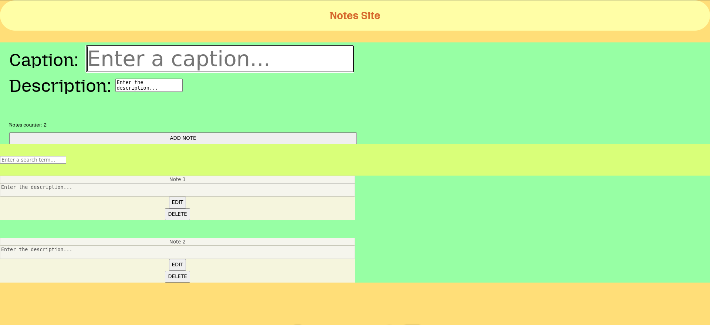

# Notes Site

A simple note-taking web application built with **HTML**, **CSS**, and **JavaScript**.  
This project was created as a practice for working with the DOM, `localStorage`, and implementing CRUD functionality.

## 🚀 Features
- **Add new notes** with a caption and description.
- **Edit existing notes** directly in the list.
- **Delete notes** with one click.
- **Search notes** by caption (case-insensitive and partial match).
- **Notes counter** that updates automatically.
- **Persistent storage** using `localStorage` (notes remain after page reload).

## 🖼 Preview


## 📂 Technologies Used
- HTML5
- CSS3 (Flexbox)
- Vanilla JavaScript (ES6+)
- LocalStorage API

## 📦 Installation & Usage
1. Clone this repository:
   ```bash
   git clone https://github.com/yari4ek89/notes-site.git
2. Open index.html in your browser.
## 🌐 Live Demo
You can view the live version here:
https://yari4ek89.github.io/notes-site/

## 📝 Project Purpose
This is a learning project to:
- Practice DOM manipulation.
- Work with localStorage.
- Implement form validation.
- Build a complete CRUD app without frameworks.

## 📌 Author
**Yaroslav**

**GitHub:** https://github.com/yari4ek89 
